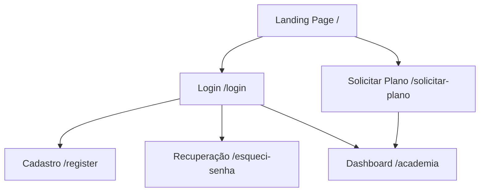

# GymFlow — Frontend Web

Interface Web do sistema GymFlow, desenvolvida para permitir a interação dos usuários com os recursos de gerenciamento de uma academia.

**Trabalho de Conclusão de Curso (TCC) — Desenvolvimento de Sistemas**

---

# 1. Documentação Geral do Projeto

## 1.1 Nome do Projeto

**GymFlow — Sistema de Gestão para Academias**

O GymFlow é uma solução tecnológica voltada ao gerenciamento de academias.

Este repositório corresponde ao **Frontend Web**, responsável pela interface visual da aplicação e pela interação dos usuários com o sistema.

O Frontend se comunica com o Backend através de uma API REST.

---

## 1.2 Problema que Resolve

O sistema busca centralizar e facilitar o gerenciamento de diferentes atividades de uma academia, como:

- Cadastro de alunos;
- Gerenciamento de funcionários;
- Controle de treinos;
- Controle financeiro;
- Registro de presenças;
- Gerenciamento de matrículas;
- Autenticação dos usuários.

O Frontend oferece uma interface para que essas funcionalidades possam ser utilizadas de maneira organizada.

---

## 1.3 Objetivo

O objetivo do Frontend Web é fornecer uma interface moderna e responsiva para utilização do GymFlow.

Entre suas principais funções estão:

- Apresentação do sistema;
- Autenticação;
- Cadastro;
- Recuperação de acesso;
- Solicitação de planos;
- Gerenciamento de alunos;
- Gerenciamento de treinos;
- Gerenciamento de funcionários;
- Controle financeiro;
- Visualização de presenças.

---

## 1.4 Público-alvo

A aplicação pode ser utilizada por diferentes usuários relacionados à gestão de academias, incluindo:

- Administradores;
- Funcionários;
- Gestores;
- Instrutores;
- Alunos.

As funcionalidades disponíveis podem variar de acordo com o fluxo de utilização e as permissões do usuário.

---

# 2. Tecnologias Utilizadas

## 2.1 Linguagens

- TypeScript
- JavaScript
- HTML
- CSS

## 2.2 Frameworks e Bibliotecas

- Next.js 16
- React 19
- Axios
- Tailwind CSS 4
- Lucide React
- React Icons
- Recharts
- Leaflet
- React-Leaflet

## 2.3 Ferramentas

- Git
- GitHub
- npm
- Visual Studio Code

---

# 3. Arquitetura do Sistema

O Frontend utiliza o **Next.js com App Router**.

A aplicação é dividida principalmente em:

- Páginas;
- Componentes reutilizáveis;
- Serviços;
- Interfaces e tipos;
- Arquivos públicos;
- Configurações do Next.js.

### 3.1 Comunicação com o Backend

O Frontend realiza requisições HTTP para o Backend utilizando o Axios.

```text
Usuário
   │
   ▼
Frontend Web
Next.js + React
   │
   │ Axios / HTTP / JSON
   ▼
Backend
Express + API REST
   │
   ▼
Prisma
   │
   ▼
SQLite
```

### 3.2 Autenticação

O usuário realiza o login através do Frontend.

O Frontend envia as credenciais para:

```text
POST /login
```

Após a autenticação, o Backend retorna um token JWT.

O Frontend utiliza esse token para realizar requisições às áreas protegidas da aplicação.

---

# 4. Estrutura do Projeto

```text
front-end3/
│
├── app/
│   ├── academia/
│   ├── esqueci-senha/
│   ├── login/
│   ├── register/
│   ├── solicitar-plano/
│   ├── globals.css
│   ├── layout.tsx
│   └── page.tsx
│
├── components/
│
├── public/
│
├── src/
│   └── services/
│
├── eslint.config.mjs
├── next.config.ts
├── package.json
├── postcss.config.mjs
├── tsconfig.json
└── README.md
```

---

# 5. Telas da Aplicação

## 5.1 Landing Page

### Rota

```text
/
```

### Objetivo

Apresentar o GymFlow e seus principais recursos.

### Funcionalidades

A página apresenta informações sobre o sistema e direciona o usuário para os principais fluxos da aplicação.

Também apresenta os planos disponíveis e opções de navegação para login e contratação.

---

# 5.2 Tela de Login

### Rota

```text
/login
```

### Objetivo

Permitir que o usuário realize sua autenticação no sistema.

### Funcionalidades

- Entrada de e-mail;
- Entrada de senha;
- Validação das informações;
- Comunicação com o endpoint `/login`;
- Recebimento do token de autenticação;
- Redirecionamento após o login.

---

# 5.3 Tela de Cadastro

### Rota

```text
/register
```

### Objetivo

Permitir o cadastro de um novo usuário.

### Funcionalidades

- Preenchimento dos dados cadastrais;
- Validação dos campos;
- Exibição de mensagens de erro;
- Navegação para o login.

---

# 5.4 Recuperação de Senha

### Rota

```text
/esqueci-senha
```

### Objetivo

Disponibilizar uma interface para o fluxo de recuperação de acesso.

### Funcionalidades

- Entrada do e-mail;
- Orientações para recuperação;
- Navegação entre as telas relacionadas à autenticação.

---

# 5.5 Solicitação de Plano

### Rota

```text
/solicitar-plano
```

### Objetivo

Permitir que o usuário realize o fluxo de solicitação de um plano.

### Etapas

#### Etapa 1 — Dados e Plano

O usuário seleciona:

- Periodicidade;
- Plano;
- Dados da academia;
- Dados do responsável.

#### Etapa 2 — Pagamento

A interface apresenta opções de pagamento e elementos visuais relacionados à escolha.

#### Etapa 3 — Confirmação

Após a conclusão do fluxo, é apresentada uma confirmação com as informações do pedido.

---

# 5.6 Dashboard da Academia

### Rota

```text
/academia
```

### Objetivo

Fornecer a área principal de gerenciamento da academia.

A tela organiza diferentes funcionalidades de gerenciamento em uma interface centralizada.

### Módulo de Alunos

Permite trabalhar com os registros de alunos, incluindo:

- Visualização;
- Cadastro;
- Edição;
- Exclusão;
- Busca e organização dos registros.

### Módulo de Treinos

Permite:

- Visualizar treinos;
- Criar treinos;
- Associar treinos a alunos;
- Editar treinos;
- Remover treinos.

### Módulo de Funcionários

Permite o gerenciamento da equipe, incluindo informações como:

- Nome;
- Cargo;
- Turno;
- Permissões administrativas.

### Módulo Financeiro

Permite visualizar e administrar informações financeiras, incluindo:

- Receitas;
- Despesas;
- Categorias de despesas;
- Resumos financeiros;
- Gráficos.

Os gráficos são desenvolvidos utilizando o **Recharts**.

### Módulo de Presenças

Permite:

- Registrar acessos;
- Visualizar registros de presença;
- Consultar as presenças do dia.

---

# 6. Navegação

O fluxo principal da aplicação pode ser representado da seguinte forma:



## 6.1 Fluxo de acesso

O usuário inicia na Landing Page.

A partir dela, pode:

- Acessar o login;
- Realizar cadastro;
- Recuperar a senha;
- Solicitar um plano.

Após a autenticação, o usuário é direcionado para o Dashboard.

---

# 7. Integração com o Backend

O Frontend utiliza o Axios para realizar as requisições HTTP.

A comunicação é realizada através da API REST do Backend.

## 7.1 Configuração da API

A URL da API pode ser configurada através da variável:

```env
NEXT_PUBLIC_API_URL=http://localhost:3000
```

## 7.2 Exemplos de recursos utilizados

O Frontend se comunica com endpoints relacionados a:

- `/login`
- `/alunos`
- `/treinos`
- `/funcionarios`
- `/receitas`
- `/despesas`
- `/presencas`
- `/matricular`
- `/desmatricular`

---

# 8. Autenticação no Frontend

O processo de autenticação ocorre da seguinte forma:

```text
Usuário
   │
   │ E-mail + senha
   ▼
Tela de Login
   │
   │ Axios
   ▼
POST /login
   │
   ▼
Backend
   │
   │ JWT
   ▼
Frontend
   │
   ▼
Área autenticada
```

Após o login, o token retornado pela API é utilizado para autenticar as requisições às funcionalidades protegidas.

---

# 9. Componentes

O projeto possui uma pasta dedicada a componentes reutilizáveis:

```text
components/
```

A utilização de componentes permite separar partes da interface que podem ser utilizadas em diferentes páginas.

Essa organização facilita:

- Reutilização;
- Manutenção;
- Organização do código;
- Padronização visual.

---

# 10. Serviços

Os serviços responsáveis pela comunicação com a API ficam organizados em:

```text
src/services/
```

Essa separação permite manter a comunicação com o Backend organizada e evita concentrar todas as chamadas HTTP diretamente nas páginas.

---

# 11. Recursos Visuais

## Tailwind CSS

Utilizado para a estilização da interface.

## Lucide React

Utilizado para ícones.

## React Icons

Utilizado como biblioteca adicional de ícones.

## Recharts

Utilizado para criação de gráficos e visualizações de dados.

## Leaflet / React-Leaflet

Utilizado para recursos de mapas na aplicação.

---

# 12. Como Executar o Projeto

## 12.1 Pré-requisitos

É necessário possuir:

- Node.js;
- npm;
- Git.

Recomenda-se utilizar Node.js 18 ou superior.

---

## 12.2 Clonar o repositório

```bash
git clone https://github.com/kauan-math/front-end3.git
cd front-end3
```

## 12.3 Instalar as dependências

```bash
npm install
```

## 12.4 Configurar a API

Crie um arquivo:

```text
.env.local
```

Na raiz do projeto.

Adicione:

```env
NEXT_PUBLIC_API_URL=http://localhost:3000
```

A URL deve corresponder ao endereço em que o Backend estiver executando.

---

## 12.5 Executar em desenvolvimento

```bash
npm run dev
```

Depois acesse:

```text
http://localhost:3000
```

---

# 13. Build

Para gerar uma versão de produção:

```bash
npm run build
```

Para iniciar a aplicação após o build:

```bash
npm run start
```

---

# 14. Scripts Disponíveis

| Comando         | Função                                        |
| --------------- | --------------------------------------------- |
| `npm run dev`   | Executa o Frontend em modo de desenvolvimento |
| `npm run build` | Gera o build de produção                      |
| `npm run start` | Inicia a aplicação em modo de produção        |
| `npm run lint`  | Executa a verificação de lint                 |

---

# 15. Integração entre Frontend e Backend

O Frontend Web e o Backend são projetos separados.

A comunicação entre eles acontece através de requisições HTTP.

```text
┌─────────────────────────────┐
│       GymFlow Frontend      │
│                             │
│ Next.js + React + Tailwind  │
└──────────────┬──────────────┘
               │
               │ HTTP / JSON
               │ Axios
               ▼
┌─────────────────────────────┐
│        GymFlow Backend      │
│                             │
│ Express + TypeScript        │
└──────────────┬──────────────┘
               │
               │ Prisma
               ▼
┌─────────────────────────────┐
│          SQLite             │
└─────────────────────────────┘
```

Essa separação permite que o Frontend seja responsável pela interface e experiência do usuário, enquanto o Backend concentra a API, autenticação, regras de negócio e acesso aos dados.

---

# 16. Categorias do TCC

De acordo com a proposta do Trabalho de Conclusão de Curso, o projeto GymFlow utiliza:

- **Backend**;
- **Frontend Web**;
- **Banco de Dados**.

O presente repositório corresponde especificamente à categoria **Frontend Web**.

O banco de dados e as regras de negócio são mantidos pelo Backend.

---

# 17. Entregáveis Relacionados ao Frontend

Este repositório contém:

- Código-fonte do Frontend Web;
- Páginas da aplicação;
- Componentes reutilizáveis;
- Serviços de integração com a API;
- Configurações do Next.js;
- Estilos;
- Recursos visuais;
- Configurações TypeScript.

---

# 18. Requisito do TCC

O Frontend Web faz parte das categorias adicionais escolhidas pelo grupo para complementar o Backend obrigatório.

Sua função é fornecer a interface gráfica através da qual os usuários interagem com os recursos disponibilizados pela API do GymFlow.
